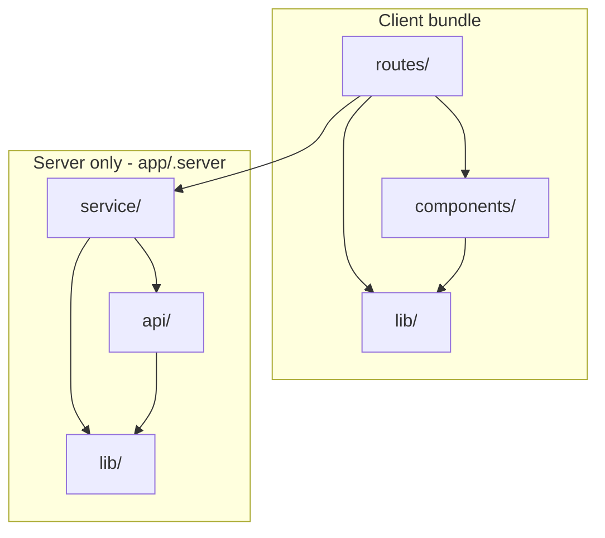

# Client-web

Architecture and conventions for the web frontend in `artifacts/client-web/`. For running the stack locally, see [local-setup.md](./local-setup.md).

The app is a React Router 7 SSR project. Server-side logic lives in a BFF layer under `app/.server/`. Imports use the `~/` alias, which maps to `app/`.

## Layers



Routes compose pages and call into services for data. Services hold business logic and call the API layer for external HTTP. Shared server utilities sit in `.server/lib/`. UI code stays in `components/` and shared client utilities in `lib/`.

## Folder structure

```
app/
├── .server/
│   ├── api/           # external HTTP clients, typed errors
│   ├── lib/           # env, result, logger, …
│   └── service/       # business logic
├── components/
│   ├── ui/            # shared presentational components
│   └── <feature>/     # feature folder
│       ├── index.ts   # public exports for this feature
│       ├── …          # components with logic
│       └── ui/        # optional; dumb UI used only in this feature
├── lib/               # hooks, cn, formatters, … shared outside .server
├── routes/            # route modules
├── routes.ts
├── root.tsx
├── entry.client.tsx
└── entry.server.tsx
```

| Path | Purpose |
|------|---------|
| `.server/api/` | All outbound network calls. Wrap failures in typed errors (`error.ts`). |
| `.server/service/` | Business logic. Routes import from here, not from `api/` directly. |
| `.server/lib/` | Server-only shared code. |
| `routes/` | Loaders, actions, and page composition. |
| `components/<feature>/` | Feature UI. One `index` file is the only entry point for outside imports. |
| `components/<feature>/ui/` | Optional. Presentational pieces private to the feature. |
| `components/ui/` | Shared presentational components without business logic. |
| `lib/` | Utilities used on the client or from both sides (not `.server`-only). |

`components/` and `lib/` are scaffolded but mostly empty until features land.

## Import rules

These are enforced by dependency-cruiser (`pnpm run lint:deps`).

- `components/` and `lib/` must not import from `.server/`.
- `.server/` must not import from `components/`.
- `routes/` must not import from `.server/api/`; use `.server/service/` instead.
- `.server/api/` must not import from `.server/service/`.
- Outside a feature folder, only import from that feature's `index.ts` (or `index.tsx`), not from internal files or `ui/`.
- A feature may import freely within its own folder, including `ui/`.

## Policies

Environment variables are defined once in `app/.server/lib/env.ts` and validated with arktype. Use `env.get(...)` everywhere else. Direct `process.env` access is blocked by Biome.

Server code follows a no-throw policy: functions return `Result` from `app/.server/lib/result.ts` instead of throwing. Routes map `Err` values to HTTP responses at the boundary.

## Authentication

The BFF authenticates users with Keycloak over OIDC. Session data and tokens live in Redis; the browser receives an httpOnly `sid` cookie with an opaque session ID.

| Route | Role |
|-------|------|
| `/login` | Sign-in page |
| `/auth/login` | Starts the OIDC flow |
| `/auth/callback` | Handles the Keycloak redirect |
| `/auth/logout` | Ends the session |

Protected routes use `protectedLoader` and `protectedAction` from `app/.server/service/routeProtection.ts`. Outbound API clients attach the Keycloak access token as a `Bearer` header via `app/.server/lib/requestAuth.ts`.

For local sign-in, realm config, and environment variables, see [local-setup.md](./local-setup.md#local-keycloak).

## Tooling

| Command | What it checks |
|---------|----------------|
| `pnpm run lint` | All lint targets |
| `pnpm run lint:code` | Biome check |
| `pnpm run lint:deps` | dependency-cruiser layer rules |
| `pnpm run lint:unused` | knip dead code |
| `pnpm run format` | Biome formatter |

From the repo root, `make lint` runs the client-web lint script inside the tooling container and similar `make format`.
